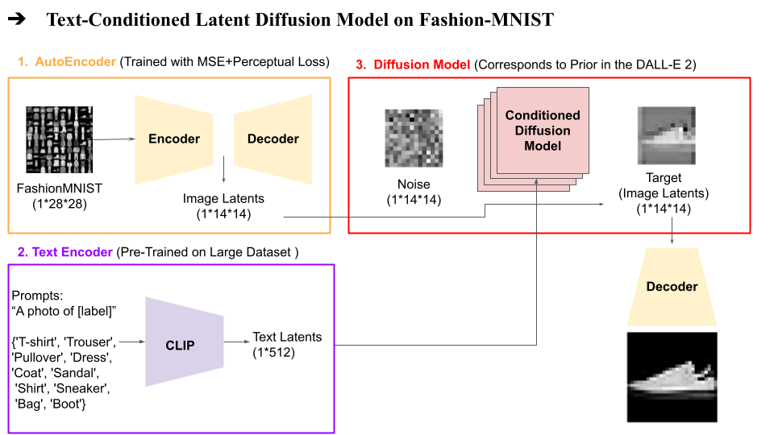
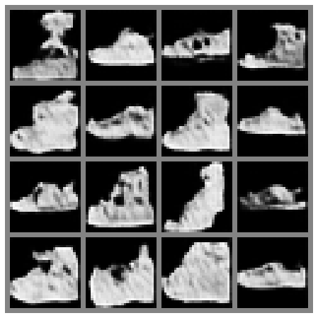

# Text Conditioned Latent Diffusion Model FashionMNIST from Scratch 

A PyTorch-based subproject for my senior thesis exploring image generation using diffusion models and ResNet autoencoders on the FashionMNIST dataset.

## Overview

This repository contains:
- A convolutional with residual connections (ResNet-like) autoencoder for latent space learning
- A diffusion model (DDPM) for image generation
- Integration with CLIP for text-guided generation
- Also a classifier network for perceptual loss.

## Directory structure

├── Project_Notebook.ipynb 	# Main experiment notebook  
├── models.py              	# Model architectures  
├── parameters/           	# Pretrained model weights  
├── data/ 			# FashionMNIST dataset  
├── example_generations/	# Example Generations  
├── slides.pptx 		# Explanatory slides  

## Example Generations
*Prompt* = Something to wear on the foot:   

  

		

## References

Ramesh, Aditya, et al. "Hierarchical text-conditional image generation with clip latents." arXiv preprint arXiv:2204.06125 1.2 (2022): 3.  
Rombach, Robin, et al. "High-resolution image synthesis with latent diffusion models, 2021." 2021.  
Radford, Alec, et al. "Learning transferable visual models from natural language supervision." International conference on machine learning. PmLR, 2021.  
He, Kaiming, et al. "Deep residual learning for image recognition. CoRR abs/1512.03385 (2015)." 2015,  
Zhang, Richard, et al. "The unreasonable effectiveness of deep features as a perceptual metric." Proceedings of the IEEE conference on computer vision and pattern recognition. 2018.    
A  similar project, with larger scale, I inspired from:  
https://github.com/explainingai-code/StableDiffusion-PyTorch/tree/main
